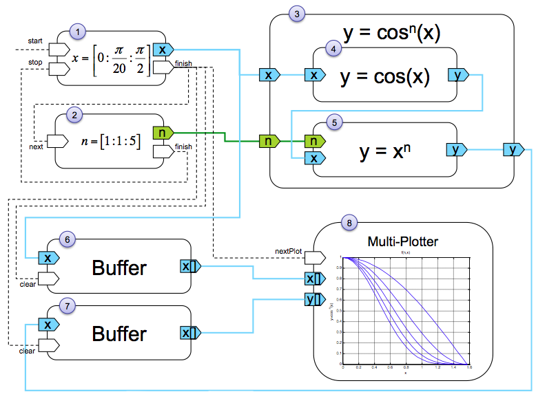

# Projet ILO

Ce document est le rapport de mon projet ILO

## Analyse du sujet
Le sujet propose de réaliser une librairie de « composants » mathématique réalisant chacun une tâche et capable de transmettre leurs résultats à d’autre composant.

## Méthodologie
Compte tenu de mon inexpérience dans certains domaines du sujet et l’impossibilité de planification à long terme (à cause d’un rendu en pleine semaine de partiels et d’autre projets qui s’ajoute avec de plus faibles échéances), j’ai décidé d’adopter une méthode agile et en particulier Extreme Programming.

Voici là manière dont j’ai découpé mon travail
- Recherche de solution architecturales
- Spike pour tester la solution qui me parait la meilleur (si le test est concluant alors j’utilise cette solution, sinon je recommence un nouveau spire)
- Construction du backlog, priorisation en fonction du barème
- une release par créneau affecté au projet (minimum 4 heures)

### Choix architecturaux
En raison de la forte orientation « flux » du projet, j’ai décidé d’utiliser le modèle d’acteur qui me semblais particulièrement adapté au sujet.
Et plutôt que de faire le (très) fastidieux travail d’implémenter mon propre modèle à l’aide de ``Serializer``, d’object boxing (merci Java pour ton typage formidable…), et d’``Observer``/``Observable`` j’ai décidé d’utiliser l’excellent framework Akka.

#### Le modèle d’acteur
Le modèle d’acteur est une approche la programmation concurrente. Un acteur est définie comme une entités capable de recevoir des « messages » et faire les trois actions suivante en réponse à ses message :
- envoyer des message à d’autres acteurs — en nombre fini
- créer — au sens instancier en POO— de nouveaux acteurs
- changer de comportement pour la réception du prochain message — l’utilisation de machine d’état peut être très utile ici.
Le développement du modèle d’acteur est très lié à celui de la programmation orientée objet. En effet le cellèbre « message passing » de Simula puis Smalltalk (origines de la POO) a fortement influencé les travaux sur le modèle d’acteur. Par la suite le modèle d’acteur s’est invité dans Smalltalk-72.

#### Akka
« Akka is the platform for the next generation of event-driven, scalable and fault-tolerant architectures on the JVM »

Akka est à l’origine un framework pour le language Scala — un language fonctionnel/objet/imperatif pour la JVM — mais l’API est 100% compatible avec le langage Java. Le framework offre à Java un modèle d’acteur simple d’utilisation, capable d’être distribué sur plusieurs machine, et résistant aux erreurs (« let it crash » pattern), et plein d’autre fonctionalités.

Je suis conscient que le choix de cette abstraction. c’est pourquoi demande de l’évaluateur, et par soucis d’équité, j’ai pris soin de réaliser aussi ma propre implémentation du modèle d’acteur. Elle est disponible dans le package ``fr.chobert.paul.ensiie.projet_ilo.actors``

### Le spike
Akka validé
On peut commencer à modéléser (inutile avant).

Lecture du barème

### R1

### R2

##  4fun !
- Distrubué
- Composant pour iPhone

# w/o Akka